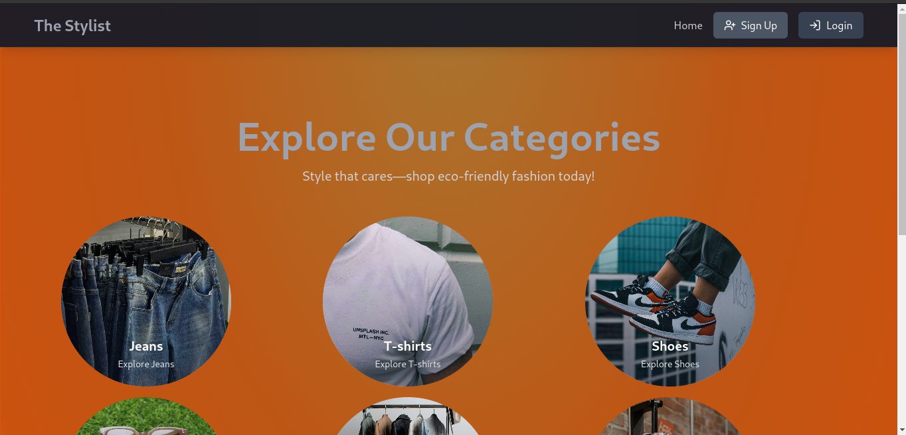
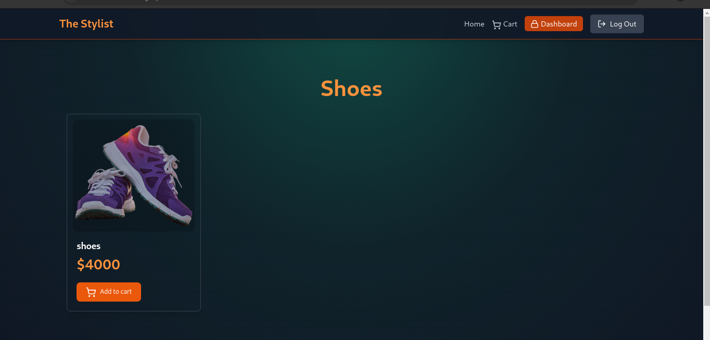
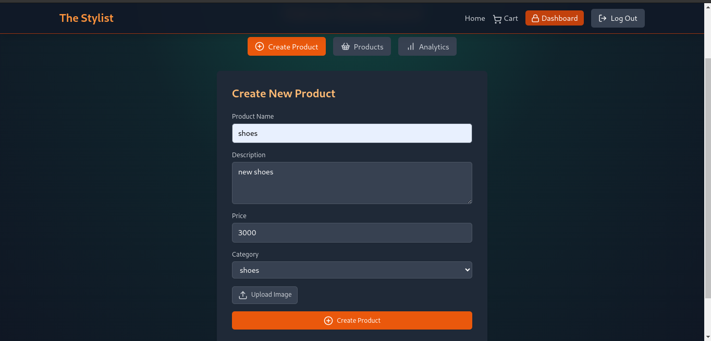
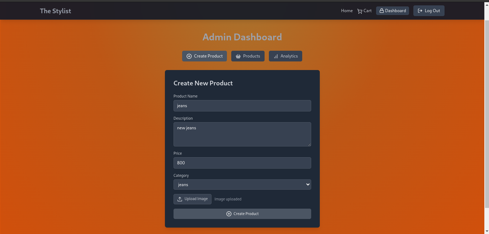
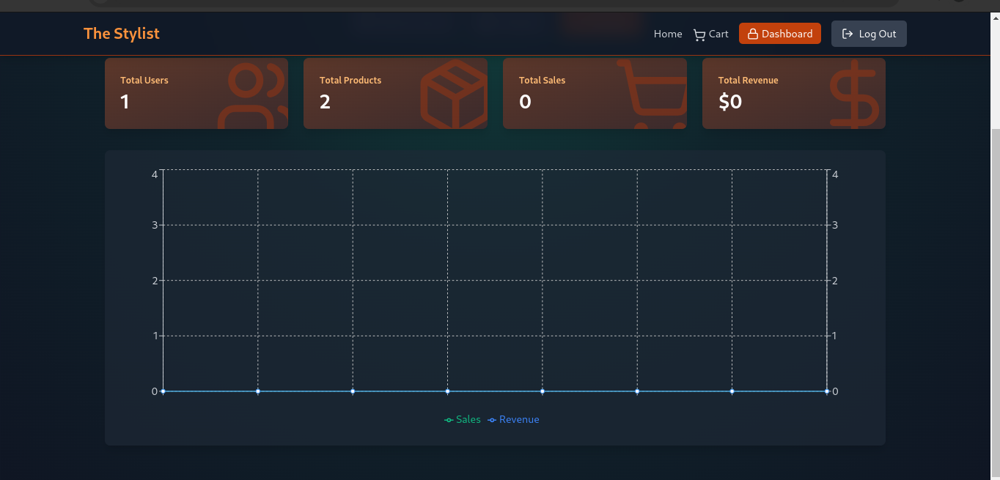
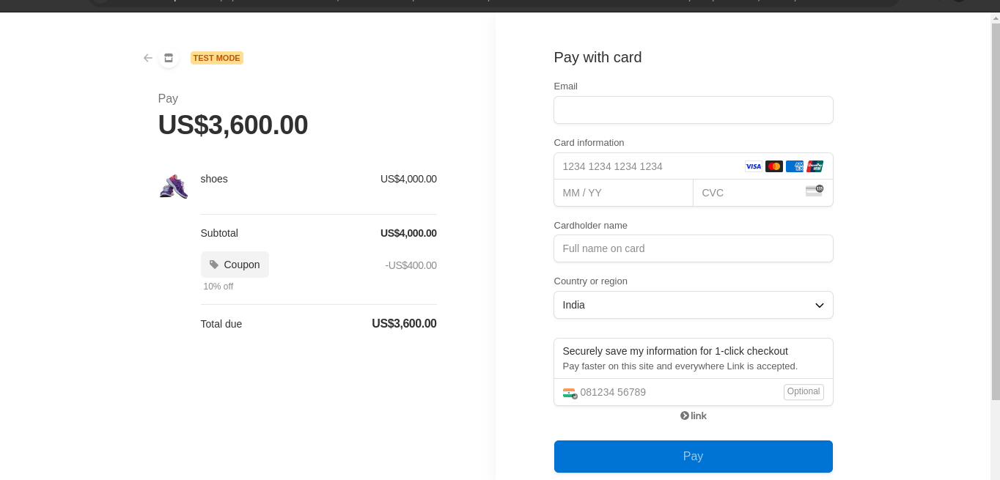

<h1 align="center">E-Commerce Project with JWT and Redis 🛒</h1>

# Project Name: The Stylist

#Important Note: To become an admin in the Stylish eCommerce app, create an email with Outlook.com.

Welcome to **The Stylist**, a cutting-edge eCommerce platform built with JWT (Json Web Token). This project harnesses the power of Redis for caching to provide a seamless shopping experience. Ready to get started? Just fork the repository and use the provided Docker Compose file!

## 🚀 Prerequisites

Before you begin, make sure you have the following installed on your machine:

- [Docker](https://www.docker.com/get-started)
- [Docker Compose](https://docs.docker.com/compose/install/)

## 📦 Getting Started

### 1. Fork the Repository

First, fork this repository to your own GitHub account.

### 2. Clone the Repository

Next, clone your forked repository to your local machine:

```bash
git clone <https://github.com/Rajatsaxenabhu/The_stylist_ecommerce>
```

## UI Screenshots

### Home Page


### Checkout Page


### Add Product Page


### Admin Page


### Revenue Graph


### Payment Page

